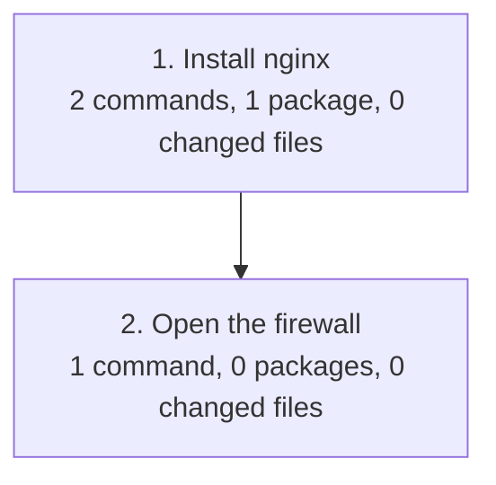

# Exarare

> **exarāre** (Latin) — literally "to plough up, to dig out". Romans wrote by
> scratching grooves into wax tablets with a stylus, so the word also came to
> mean, poetically, "to write".

Exarare records the work you do while building a Linux server over SSH and
turns it into a **Markdown runbook** and an **Ansible playbook** — without an
LLM, using plain rules.

Target platforms: **RHEL and AlmaLinux 8, 9 and 10**. Recording also works on
macOS, which is handy for development.

> [!WARNING]
> Exarare is at an early stage. Command recording and file diffs work today;
> package detection and runbook / playbook generation are under development
> (see [Roadmap](#roadmap)).

## Why

Tools that record a terminal session capture command lines and output, but
they cannot tell you *which packages* `dnf` actually installed or *what
changed* inside the files you edited. Exarare combines:

1. **Command recording** — a recording shell with hooks captures every command
   line, its working directory, exit code and time.
2. **System state diffs** — snapshots taken before and after the session
   reveal edited files, installed packages, enabled services, firewall rules
   and users.
3. **Rule-based generation** — the recorded events and diffs are mapped to
   runbook sections and Ansible modules (`dnf`, `copy`, `systemd`,
   `firewalld`, `user`, ...).

## Installation

Each release on the
[Releases](https://github.com/volanja/exarare/releases) page carries a
statically linked binary and an RPM for x86_64 and aarch64, with a SHA-256
checksum beside each file. One static binary runs on EL 8, 9 and 10, whatever
their glibc.

```sh
# RPM
sudo dnf install ./exarare-0.1.0-1.x86_64.rpm

# or the binary on its own
tar xf exarare-x86_64-unknown-linux-musl.tar.gz
sudo install -m 0755 exarare /usr/local/bin/
```

From source, with Rust 1.85 or later:

```sh
cargo install --git https://github.com/volanja/exarare
```

## Usage

Start a recording shell. Run it as root when you are going to build a server,
so that everything you do is captured in one session:

```sh
sudo exarare start --name "web01 nginx setup"
```

The prompt gets a `[rec]` prefix. Work as usual:

```sh
[rec] # exarare step "Install nginx"
[rec] # dnf install -y nginx
[rec] # vi /etc/nginx/nginx.conf
[rec] # exarare note "listen changed to 8080"
[rec] # systemctl enable --now nginx
[rec] # exit
```

`exit` (or `exarare stop`) finishes the recording.

### Commands

| Command | Description |
|---|---|
| `exarare start [-n NAME] [--shell PATH] [--snapshot PATH]... [--watch PATH]... [--no-watcher]` | Start a recording shell (bash or zsh; defaults to `$SHELL`) |
| `exarare stop` | Finish the current recording |
| `exarare status` | Show whether the current shell is being recorded |
| `exarare list` | List recorded sessions |
| `exarare diff [ID]` | Show the file changes of a session (default: the most recent) |
| `exarare gen md [ID] [-o FILE] [--lang en\|ja] [--mermaid]` | Write a Markdown runbook for a session |
| `exarare gen ansible [ID] [-o DIR] [--lang en\|ja]` | Write an Ansible playbook for a session |
| `exarare step TEXT` | Start a step of the runbook |
| `exarare note TEXT` | Add a remark to the step being worked on |

### The runbook

```sh
exarare gen md -o runbook.md
```

The document has a fixed shape. Some of it is generated, some of it is a
template only a human can fill in — Exarare does not guess at intent:

| Chapter | Source |
|---|---|
| 1. Purpose | template: what, why, definition of done |
| 2. Overview of the work | generated: the steps in order, with counts |
| 3. Prerequisites | generated host and watched paths, plus a template |
| 4. Procedure | generated: one section per `exarare note`, with commands and diffs |
| 5. What changed | generated: every changed file |
| 6. Verification | generated candidates (`systemctl status`, `curl`, ...), expected results left blank |
| 7. Rollback | generated candidates, behind a warning that they are not a verified procedure |
| Appendix A | generated: every command that ran, including failures and retries |
| Appendix B | generated: how the document was produced |

Chapter 4 shows only the commands that worked, so trial and error does not
become an instruction; nothing is lost, because appendix A keeps everything.
A file is placed in the step whose commands name its path.

Two commands shape the document while you work:

- `exarare step "Install nginx"` starts a step. It becomes an entry in the
  overview and a section of the procedure. A session without steps is a single
  step.
- `exarare note "fails unless EPEL is enabled"` records a remark about the step
  in progress. It appears where it was recorded, between the commands, so a
  warning stays next to what it is about.

The fixed text is available in English (default) and Japanese, selected with
`--lang` or the `EXARARE_LANG` environment variable. Recorded commands, paths
and diffs are never translated.

`--mermaid` draws chapter 2 as a flowchart instead of a numbered list, one node
per step:

````markdown

````

GitHub renders it; a reader looking at the raw Markdown sees the source, which
is why the list is the default.

### File changes

Two kinds of directory are involved, and they answer different questions.

| Flag | Default | What it gives you |
|---|---|---|
| `--snapshot PATH` | `/etc` | content snapshotted before and after, so changes come with a diff |
| `--watch PATH` | `/opt`, `/usr/local`, `/srv`, `/var/www`, `/root`, `/home`, when they exist | paths that were written to, with no content recorded |

`--no-watcher` turns the second one off.

Snapshots say what a file became. The watcher says a file was written to at
all, which covers what snapshots cannot: a directory nobody thought to
snapshot, and a file that was edited and then put back. Only paths are
recorded there — never content — and a path is placed in the step whose
commands were running when the write happened.

These are never watched, because they say nothing about the work or would never
stop reporting: `/proc`, `/sys`, `/dev`, `/run`, `/tmp`, `/var/tmp`,
`/var/log`, `/var/cache`, `/var/lib/rpm`, `/var/lib/dnf`, `/var/lib/systemd`,
`/var/lib/selinux`, `/var/spool`, container storage, shell history files,
editor temporary files, `*.lock`, `__pycache__` and `.git`. Exarare's own data
directory is excluded too, or it would watch itself writing the session.

At most 10,000 paths are remembered, and a directory that cannot be watched —
usually because the kernel's watch limit is reached — is recorded as a gap. The
runbook says so rather than presenting a partial list as complete.

`exarare diff` reports added, removed, modified and re-permissioned files from
the snapshots, with a unified diff for text files, and then the touched paths:

```console
$ exarare diff
modified     /etc/nginx/nginx.conf
  --- a/etc/nginx/nginx.conf
  +++ b/etc/nginx/nginx.conf
  @@ -34,7 +34,7 @@
  -        listen       80;
  +        listen       8080;
permissions  /etc/nginx/conf.d/tls.conf
  mode 644 -> 600, owner 0:0 -> 0:0
```

Files that change on their own (`/etc/ld.so.cache`, `/etc/mtab`, lock files,
editor backups) are skipped. For secrets (`/etc/shadow`, `*.key`, `*.pem`,
anything under a `private/` directory) the change is reported but the content
is never stored. Content is stored only for text files up to 1 MiB.

### The playbook

```sh
exarare gen ansible -o ansible
```

This writes `ansible/playbook.yml` and an `ansible/files/` tree holding the
content of the files that changed. What the probes observed becomes a task:

| Observed | Module |
|---|---|
| package installed on purpose | `ansible.builtin.dnf` |
| file added or edited | `ansible.builtin.copy` (content under `files/`, `backup: true`) |
| file removed | `ansible.builtin.file`, `state: absent` |
| only mode changed | `ansible.builtin.file` with `mode` |
| unit enabled or started | `ansible.builtin.systemd` |
| firewall service or port | `ansible.posix.firewalld` |
| user or group | `ansible.builtin.user` / `ansible.builtin.group` |
| anything else that ran | `ansible.builtin.command` or `shell`, behind a TODO |

The generated playbook passes `ansible-lint` at its `production` profile, which
CI checks on every change. The firewall tasks need the `ansible.posix`
collection.

A few things are deliberately left to a human, and each is marked in the file
and printed when the playbook is generated:

- A command no probe could explain is replayed exactly as it was typed, with
  `changed_when: true` and a `TODO: make idempotent` comment. Claiming
  `changed_when: false` would be a lie, and dropping the command would hide
  work that mattered.
- A file whose content was not recorded — a secret, a binary, or one over the
  size limit — gets a TODO instead of a copy task, because the content is
  genuinely unavailable.
- The recorded owner is written as a comment with its numeric uid and gid,
  since the same numbers may belong to different accounts on the target host.

Task names are always English: `ansible-lint` requires them to start with a
capital letter. `--lang` changes the comments, which are what a reviewer reads.

### Packages

Exarare reads the rpm database before and after the session instead of parsing
what `dnf` printed, so the record does not depend on the dnf version or on
whether the install came from a script:

- packages installed, removed and upgraded, with versions
- which of them were asked for by name, and how many came along as
  dependencies (`dnf repoquery --userinstalled`)
- repositories enabled or disabled, and module streams enabled on EL8 and EL9

A package is placed in the step whose commands name it, the same way files are.
On a host without rpm — macOS, or a Debian-based system — nothing is recorded
and the runbook says so, rather than reporting every package as removed.

### Services, firewall and accounts

The same before-and-after comparison covers state that does not live in a file:

- units enabled or disabled at boot, and services running afterwards
  (`systemctl list-unit-files`, `list-units`)
- firewalld services and ports, from the permanent configuration
- users and groups, read from `/etc/passwd` and `/etc/group` — never from
  `/etc/shadow`, so no password hash is ever recorded

A unit is placed in the step that named it, including when the command leaves
the suffix off, as `systemctl enable nginx` does. A subsystem that does not
answer — systemd inside a container, a stopped firewalld — is reported as not
recorded, which is not the same as reporting no change.

Persistent settings under `/etc`, such as sysctl drop-ins and unit overrides,
are already covered by the file snapshots.

### Where data is stored

Sessions are saved under `~/.local/share/exarare/sessions/<id>/`
(`$XDG_DATA_HOME/exarare` if set, or `$EXARARE_HOME`). The directory is
readable only by its owner, because recordings can contain secrets.

| File | Content |
|---|---|
| `meta.json` | Session name, host, user, shell, watched directories, start and end time |
| `events.jsonl` | One JSON event per line: commands, exit codes, notes |
| `snapshots/before.jsonl`, `snapshots/after.jsonl` | One entry per file: hash, size, mode, owner |
| `packages/before.json`, `packages/after.json` | Installed packages, explicit installs, repositories, module streams |
| `state/before.json`, `state/after.json` | Enabled units, running services, firewall rules, users, groups |
| `touched.json` | Paths the watcher saw being written to, with the time each was first seen |
| `blobs/` | Content of the text files, addressed by hash |

### Limitations

- Supported shells are bash and zsh.
- While recording, `HISTCONTROL` and `HISTIGNORE` are cleared so that no
  command escapes the record.
- The bash hook uses the `DEBUG` trap, so it replaces other tools that also
  use it (e.g. bash-preexec).
- Commands run in a shell started inside the recording shell (e.g. `sudo -i`)
  are not recorded. Start the recording as root instead.
- Command output is not recorded yet.
- Content is only recorded for the `--snapshot` directories. Elsewhere the
  watcher can say a file was touched, but not what changed inside it.
- A non-ASCII step title or note needs a UTF-8 locale. bash 3.2, which macOS
  still ships, passes a mangled argument when `LC_ALL`, `LC_CTYPE` and `LANG`
  all say the encoding is single-byte. Exarare warns at `exarare start` when
  that is the case; set `LC_ALL` to a UTF-8 locale to avoid it. The locale is
  not changed for you, because that would also change the behaviour of the
  commands being recorded.

## Development

```sh
cargo fmt --all --check
cargo clippy --all-targets -- -D warnings
cargo test
```

The tests drive a real shell rather than a stub: `tests/record.rs` starts bash
and zsh, types commands into them and reads back what was recorded, so both
shells need to be installed. The zsh test skips itself when zsh is missing.

### Checking a generated playbook

CI lints the generated playbook, but running the linter locally catches a
violation a round trip earlier:

```sh
python3 -m venv /tmp/ansible-venv && /tmp/ansible-venv/bin/pip install ansible-lint
```

Record a session, generate a playbook and lint it:

```sh
exarare gen ansible -o playbook-en
/tmp/ansible-venv/bin/ansible-lint playbook-en/playbook.yml
```

The playbook is expected to pass at ansible-lint's `production` profile. CI has
the last word: a local ansible-lint is pinned by whatever Python the system
ships, and may be several releases behind.

### Coverage

```sh
cargo install cargo-llvm-cov   # once
cargo llvm-cov --summary-only
```

`octocov` reports the same number on every pull request. Do not chase the
figure for `src/shell.rs`: the hooks are shell code inside Rust string
constants, so the constants count as covered while the shell logic itself is
measured by `tests/record.rs` running a real shell.

### What only CI can check

- the recording shell against bash 4.4, 5.1 and 5.2 on AlmaLinux and UBI 8, 9
  and 10, and the zsh of each
- `dnf` and `rpm` behaviour across those releases, where `tests/el_smoke.rs`
  installs a package and edits `/etc`
- these tests touch the system, so they only run with `EXARARE_EL_TESTS=1`,
  inside throwaway containers

systemd and firewalld do not run in those containers, so their probes are
covered by unit tests over captured output and need a VM for a real check.

## Roadmap

- [x] Recording shell (bash / zsh hooks)
- [x] File snapshots and diffs
- [ ] Markdown runbook generation
- [x] Probe for RPM / dnf
- [x] Probes for systemd, firewalld, users and groups
- [x] Ansible playbook generation
- [x] Watch for touched files (inotify / FSEvents)
- [ ] Optional auditd backend
- [ ] CI on AlmaLinux / UBI 8, 9 and 10, static binaries and RPM packages

## License

Licensed under either of

- Apache License, Version 2.0 ([LICENSE-APACHE](LICENSE-APACHE))
- MIT license ([LICENSE-MIT](LICENSE-MIT))

at your option.
